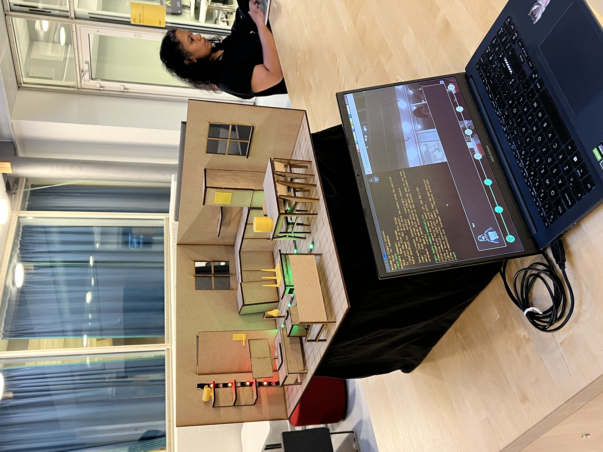
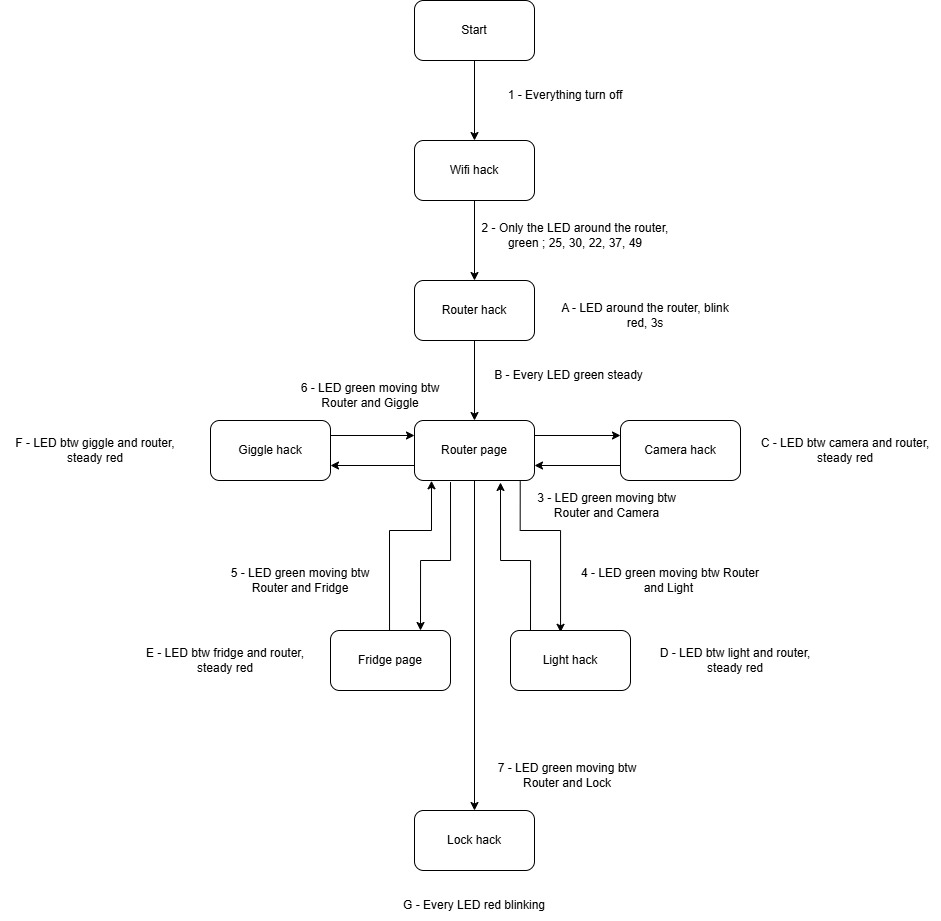

# IoT-Security-Minigames__EPS_OsloMet
Set of minigames used as part of an interactive exhibition that teaches users about the main cyber security vulnerabilities of Smart Home Devices

## Game List:
1. **Cracking the home Wi-Fi**
    - The player uses *Fern Wifi Cracker* to gain a foothold into a home network that is configured with an unsecure security protocol

2. **Exploiting the outdated router**
    - After accessing the network, the player runs an exploit against a router that is using an old and unpatched firmware version. 

3. **Brute-forcing the security camera**
    - Using a common-credentials wordlist and the *hydra* tool, the player is able to crack the login of the security camera. 

4. **Password reuse to access the smart lamp**
    - The player reuses the credentials discovered in the previous attack to log in to Smart Lamp management panel. 

5. **Discovering unencrypted credentials sent by the smart fridge**
    - The player uses *wireshark* to sniff the traffic going through the network and finds out that the fridge is sending unencrypted credentials through the network (using HTTP instead of HTTPS) 
 
6. **Eavesdropping on conversations through the Home Pod** 
    - These credentials give the player access to the Home Pod where he is able to listen to an audio recording of a conversation where the PIN for the smart lock is mentioned 

7. **Unlocking the front door**
    - The PIN is used to unlock the Smart Lock 

## Flow Diagram with LED instructions

